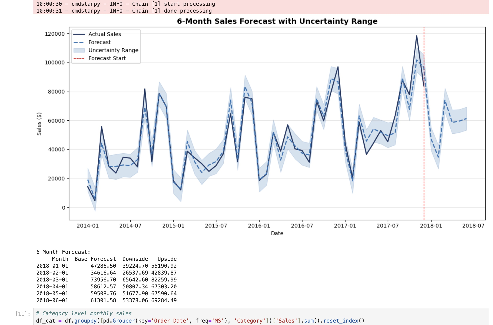

# Sales Forecasting & Scenario Planning | H1 2018 Outlook

## Project Summary
Time-series forecasting analysis using Facebook Prophet to project 
6-month revenue, identify seasonal demand patterns, and develop 
base/downside/upside scenarios for commercial planning.

This project replicates the forecasting and scenario planning work 
of a commercial/insights analyst: data preparation in Python, 
Prophet-based forecasting, category trend analysis, and findings 
communicated via an executive decision memo.

---

## Business Questions Answered
- What does the next 6 months of revenue look like?
- What are the base, downside, and upside scenarios?
- What seasonal patterns should drive planning decisions?
- Which months represent the highest risk and opportunity?

---

## Key Findings
- **Base forecast: $334,285 for H1 2018** with a $287K–$384K scenario range
- **February is the weakest month** ($34,617 base) — ideal window for 
  targeted promotional investment in high-margin categories
- **March shows the sharpest recovery** ($73,957 base) — inventory and 
  supply chain should be aligned ahead of this window
- **Technology shows the strongest growth trajectory** across all four 
  years of historical data

---

## Scenario Planning Summary

| Month | Downside | Base Forecast | Upside |
|---|---|---|---|
| Jan-18 | $39,225 | $47,287 | $55,191 |
| Feb-18 | $26,538 | $34,617 | $42,840 |
| Mar-18 | $65,643 | $73,957 | $82,260 |
| Apr-18 | $50,807 | $58,613 | $67,303 |
| May-18 | $51,678 | $59,509 | $67,591 |
| Jun-18 | $53,378 | $61,302 | $69,284 |
| **Total** | **$287,272** | **$334,285** | **$384,469** |

---

## Tools Used
- **Python (Pandas)** — data cleaning, aggregation, monthly time series
- **Prophet** — time-series decomposition and forecasting
- **Matplotlib** — historical trend and forecast visualisations
- **Excel/PDF** — scenario planning table and executive decision memo

---

## Files in This Repository
| File | Description |
|---|---|
| `sales_forecasting_analysis.ipynb` | Full Jupyter Notebook with all code |
| `monthly_sales_trend.png` | Historical monthly sales trend chart |
| `sales_forecast.png` | 6-month forecast with uncertainty range |
| `category_trends1.png`,`category_trends2.png` | Category-level trend charts |
| `Sales_Forecasting_Decision_Memo.pdf` | Executive scenario planning memo |

---

## Forecast Methodology
Model: Facebook Prophet with yearly seasonality.
Training data: 48 months (FY2014–2017).
Forecast horizon: 6 months (Jan–Jun 2018).
Uncertainty intervals represent 80% confidence range.

---

## Dashboard Preview

---

## Author
**Milind Thapar**
[LinkedIn](https://www.linkedin.com/in/milindthapar) |
[GitHub](https://github.com/milindthapar)
